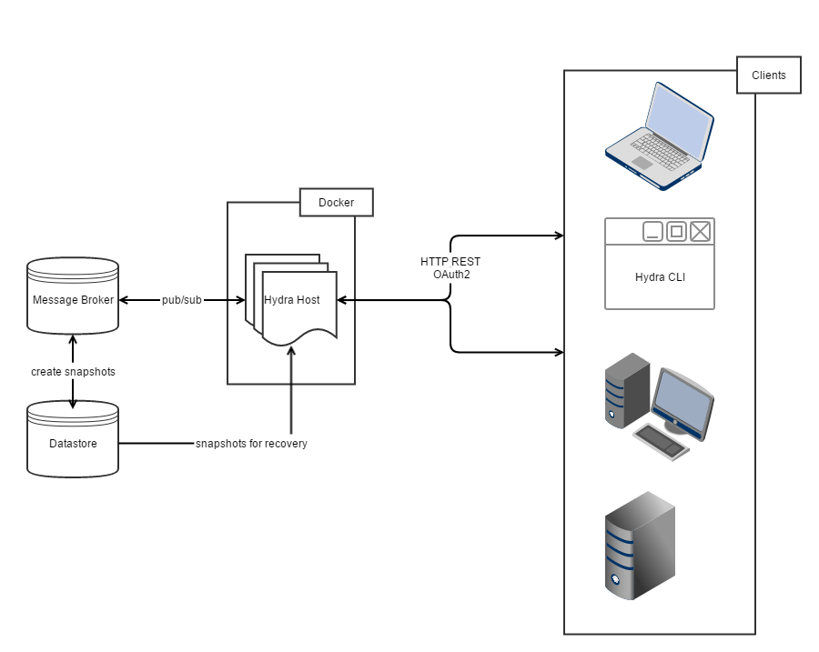

# What is [Hydra](https://github.com/ory-am/hydra)?

At first, there was the monolith. The monolith worked well with the bespoke authentication module.
Then, the web evolved into an elastic cloud that serves thousands of different user agents
in every part of the world.

Hydra is driven by the need for a **scalable in memory
OAuth2 and OpenID Connect** layer, that integrates with every Identity Provider you can imagine.

Hydra is available through [Docker](https://hub.docker.com/r/oryam/hydra/) and at [GitHub](https://github.com/ory-am/hydra).

### Feature Overview

1. **Availability:** Hydra uses pub/sub to have the latest data available in memory. The in-memory architecture allows for heavy duty workloads.
2. **Scalability:** Hydra scales effortlessly on every platform you can imagine, including Heroku, Cloud Foundry, Docker,
Google Container Engine and many more.
3. **Integration:** Hydra wraps your existing stack like a blanket and keeps it safe. Hydra uses cryptographic tokens for authenticate users and request their consent, no APIs required.
The deprecated php-3.0 authentication service your intern wrote? It works with that too, don't worry.
We wrote an example with React to show you how this could look like: [React.js Identity Provider Example App](https://github.com/ory-am/hydra-idp-react).
4. **Security:** Hydra leverages the security first OAuth2 framework **[Fosite](https://github.com/ory-am/fosite)**,
encrypts important data at rest, and supports HTTP over TLS (https) out of the box.
5. **Ease of use:** Developers and Operators are human. Therefore, Hydra is easy to install and manage. Hydra does not care if you use React, Angular, or Cocoa for your user interface.
To support you even further, there are APIs available for *cryptographic key management, social log on, policy based access control, policy management, and two factor authentication (tbd)*
Hydra is packaged using [Docker](https://hub.docker.com/r/oryam/hydra/).
6. **Open Source:** Hydra is licensed Apache Version 2.0
7. **Professional:** Hydra implements peer reviewed open standards published by [The Internet Engineering Task Force (IETF®)](https://www.ietf.org/) and the [OpenID Foundation](https://openid.net/)
and under supervision of the [LMU Teaching and Research Unit Programming and Modelling Languages](http://www.en.pms.ifi.lmu.de). No funny business.
8. **Real Time:** Operation is a lot easier with real time monitoring. Because Hydra leverages RethinkDB, you get real time monitoring for free.

## *Where's my product demo?*

It's on [GitHub](https://github.com/ory-am/hydra#run-the-example). Give it a try or enjoy the GIF.

[Run the example](run-the-example.gif)

## Availability

Hydra uses pub/sub to have the latest data always available in memory. RethinkDB makes it possible to recover from failures and synchronize the cluster when something changes. Data is kept in memory for best performance results. The storage layer is abstracted and can be modified to use RabbitMQ or MySQL amongst others.

The message broker keeps the data between all host process in synch. This results in effortless `hydra host` scaling on every platform you can imagine: Heroku, Cloud Foundry, Docker, Google Container Engine and many more.

Serving a uniform API reduces security risks. This is why all clients use REST and OAuth2 HTTP APIs. The Command Line Interface (CLI) `hydra`, responsible for managing the cluster, uses these as well.

## Security

There is no unbreakable system. But we're trying to make breaking in really hard:

- Built in support for HTTP 2.0 over TLS.
- [BCrypt](https://en.wikipedia.org/wiki/Bcrypt) hashes credentials.
- The database never stores complete and valid tokens, only their signatures.
- JWKs are encrypted at rest using AES256-GCM
- Unit and integration tested.
- It's written in Google Go.
- It's Open Source.

## Interoperability

**In a nutshell:** We did not want to provide you with LDAP, Active Directory, ADFS, SAML-P, SharePoint Apps, ... integrations which probably won't work well anyway. Instead we decided to rely on cryptographic tokens (JSON Web Tokens) for authenticating users and getting their consent. This gives you all the freedom you need with very little effort. JSON Web Tokens are supported by all web programming languages and Hydra's [JSON Web Key API](jwk.html) offers a nice way to deal with certificates and keys.

The Customer Journey looks the same:

