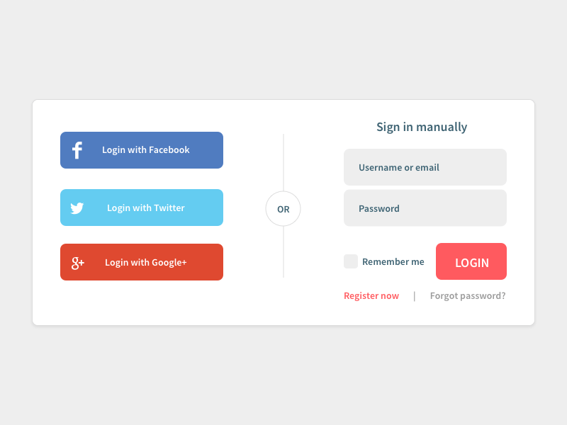
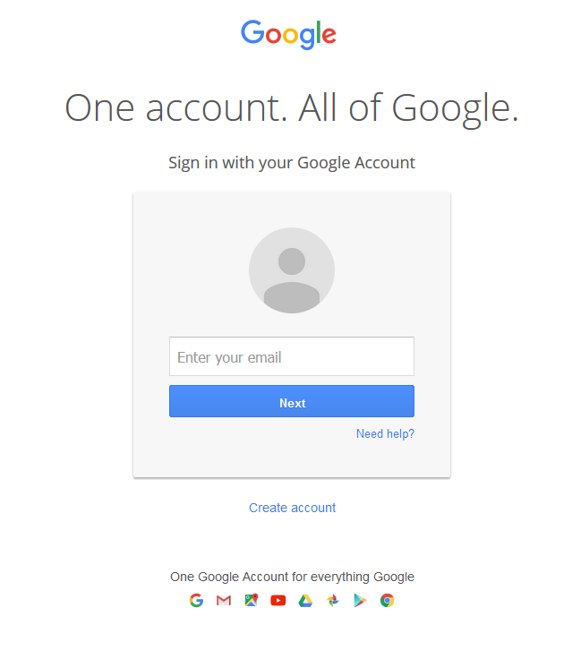
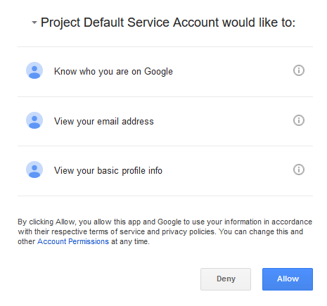

# Social Logon

Social login, also known as social sign-in, is a form of single sign-on using existing login information from a social networking service such as Facebook, Twitter or Google+ to sign into a third party website instead of creating a new login account specifically for that website. It is designed to simplify logins for end users as well as provide more and more reliable demographic information to web developers. *[Source: Wikipedia](https://en.wikipedia.org/wiki/Social_login)*

## Example flow

### The log in screen

### Logging in with Google Account

### User authorizes access

### Login completed

## What's happening in the background

Depending on the third party's APIs you complete the sign in request with OAuth 1.0, OAuth2, OpenID Connect, or some other flow. In any case, you will receive (e.g. /userinfo, id token, ...) a user id from that service, e.g. `googleuser:u398fjka8f2hj28g`. We call this value the **remote subject**, the login provider (e.g. Google) **provider**, and the users stored in your private MySQL/LDAP/... database **local subjects**.

You can pass the provider and the remote subject values to the [Social Login API](http://docs.hdyra.apiary.io/#reference/social-login-sso) and look up if one of your local subjects is linked to that third party account. If there is a match you can use the local subject value to identify and authenticate the user. If there is no match, you will probably send him to your sign up page.