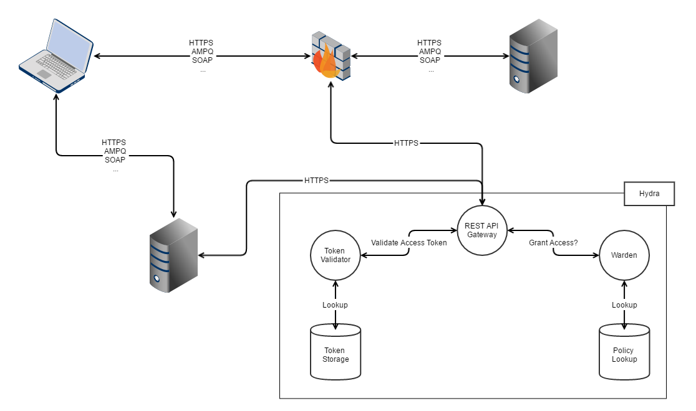

# Access Control (Policies & Warden)

Hydra uses the Access Control Library [Ladon](https://github.com/ory-am/ladon). Read the [Ladon Docs](https://github.com/ory-am/ladon#ladon).

In Hydra, access control is when you decide if
- Aaron (subject) is allowed (effect) to create (action) a new forum post (resource) when accessing the forum website from IP 192.168.178.3 (context).
- Richard (subject) is allowed (effect) to delete (action) a status update (resource) when he is the author (context).

Or, more *generalized:* **Who** is **able** to do **what** on **something** with some **context**.

* **Who (Subject)**: An arbitrary unique subject name, for example "ken" or "printer-service.mydomain.com".
* **Able (Effect)**: The effect which is always "allow" or "deny".
* **What (Action)**: An arbitrary action name, for example "delete", "create" or "scoped:action:something".
* **Something (Resource)**: An arbitrary unique resource name, for example "something", "resources:articles:1234" or some uniform resource name like "urn:isbn:3827370191".
* **Context (Context)**: The current context which may environment information like the IP Address, request date, the resource owner name, the department ken is working in and anything you like.

Here are two common ways to solve access control over the network: Either you servers and services (read: APIs) are behind a gateway (e.g. access control, rate limiting, and load balancer) that does the access control for them ("trusted network/subnet"). Or clients talk to your server and services (read: APIs) directly and check access privileges themselves.



## Policies

Policies are documents managed via the [Policy API](http://docs.hdyra.apiary.io/#reference/policies). A policy is a JSON document:

```
{
  // A required unique identifier. Used primarily for database retrieval.
  "id":"68819e5a-738b-41ec-b03c-b58a1b19d043",
  
  // A optional human readable description.
  "description":"something humanly readable",
  
  // A subject can be an user or a service. It is the "who" in "who is allowed to do what on something".
  // As you can see here, you can use regular expressions inside < >.
  "subjects":["user", "<peter|max>"],
    
  
  // Should access be allowed or denied?
  // Note: If multiple policies match an access request, ladon.DenyAccess will always override ladon.AllowAccess
  // and thus deny access.
  "effect":"allow",
  
  // Which resources this policy affects.
  // Again, you can put regular expressions in inside < >.
  "resources":["articles:<[0-9]+>"],
  
  // Which actions this policy affects. Supports RegExp
  // Again, you can put regular expressions in inside < >.
  "actions":["create","update"],
  
  // Under which conditions this policy is "active".
  "conditions":{
    "owner":{
     // In this example, the policy is only "active" when the requested subject is the owner of the resource as well.
      "type":"EqualsSubjectCondition",
      "options":{}
    }
   }
}
```

### More Examples

```
[
  {
    "description": "Allow everyone including anonymous users to read JSON Web Keys having Key ID *public*.",
    "subject": ["<.*>"],
    "effect": "allow",
    "resources": [
      "rn:hydra:keys:<[^:]+>:public"
    ],
    "permissions": [
      "get"
    ]
  }
]
```

```
[
  {
    "description": "Explicitly deny everyone reading JSON Web Keys with Key ID *private*.",
    "subject": ["<.*>"],
    "effect": "allow",
    "resources": [
      "rn:hydra:keys:<[^:]+>:private"
    ],
    "permissions": [
      "get"
    ]
  }
]
```

## Warden

Before we start, give the [Warden examples](https://github.com/ory-am/ladon) a read. The Warden has two HTTP endpoints. You can look at them [here](http://docs.hdyra.apiary.io/#reference/warden/authorized-basic-access-control/basic-access-control).

The *Basic Access Control* endpoint checks if a token is valid and the requested scopes are satisfied. The POST body must be encoded in JSON and contain:

```
{
  "scopes": [
    "core",
    "some.scope.create",
    "some.scope.delete"
  ],
  "assertion": "z4ab93c94111439fb..."
}
```

* **scopes:** A list of scopes.
* **assertion:** The token to be inspected.


The *Policy Based Access Control* endpoint additionally checks if the token's subject is allowed to perform an action:

```
{
  "scopes": [
    "core",
    "some.scope.create",
    "some.scope.delete"
  ],
  "assertion": "z4ab93c94111439fb...",
  "resource": "resources:blogs:posts:my-first-post",
  "action": "create",
  "subject": "alice",
  "context": {
    "owner": "alice"
  }
}
```

Remember the policy from above?

```
  "conditions":{
    "owner":{
     // In this example, the policy is only "active" when the requested subject is the owner of the resource as well.
      "type":"EqualsSubjectCondition",
      "options":{}
    }
   }
```

In this case, 

```
  "subject": "alice",
  "context": {
    "owner": "alice"
  }
```

satisfies the policies `condition` because the `context.owner` field is queal to the `subject` field, as requested by `"type":"EqualsSubjectCondition"`. The different condition types are documented in the [Ladon Readme](https://github.com/ory-am/ladon#ladon).